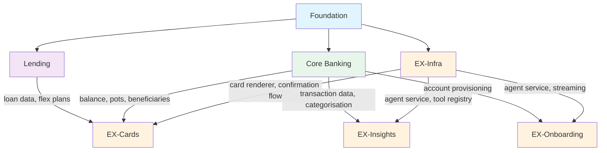

# Cross-Squad Dependencies

> **Phase 3 Output** | CPTO Review | March 2026
>
> Dependency map, shared components, contract testing strategy, and merge plan.

---

## 1. Dependency Map

### 1.1 Squad-Level Dependencies



### 1.2 Critical Path

```
Foundation (F1a → F1b → F2)
    │
    ├── EX-Infra (Days 1-5) ← CRITICAL PATH
    │       │
    │       ├── EX-Cards (Days 4-10)
    │       ├── EX-Onboarding (Days 4-10)
    │       └── EX-Insights (Days 5-12) ← depends on CB-3 (categorisation)
    │
    ├── Core Banking (Days 1-15)
    │       └── CB-3 (categorisation) must complete by Day 5 for EX-Insights
    │
    └── Lending (Days 1-15, prep only)
```

**Bottleneck analysis:** EX-Infra is the single biggest bottleneck. If it slips past Day 5, three streams are blocked. Foundation's SSE validation (V1) is the input dependency for EX-Infra. If V1 fails, the entire schedule shifts.

### 1.3 Feature-Level Dependency Matrix

| Feature | Produces | Consumed By | Blocking? |
|---------|----------|-------------|-----------|
| Foundation: Tool registry | Tool registration pattern | All squads | YES — no tools without it |
| Foundation: API scaffolding | Route registration, middleware | All squads | YES — no endpoints without it |
| Foundation: Shared types | TypeScript types, enums | All squads | YES — type errors without it |
| EX-Infra: Card renderer | UIComponent → React component | EX-Cards, CB, LE | YES — no cards without it |
| EX-Infra: ConfirmationCard | Two-phase confirmation UI | CB, LE (all writes) | YES — no write tools without it |
| EX-Infra: Agent loop | POST /api/chat orchestration | All squads | YES — no chat without it |
| EX-Infra: SSE consumer | Stream parsing, state machine | All EX streams | YES — no streaming without it |
| CB: Transaction categorisation | Categorised transaction data | EX-Insights | PARTIAL — insights degraded without it |
| CB: Balance tools | Account balance data | EX (BalanceCard, greeting) | PARTIAL — greeting works without it |
| CB: Beneficiary tools | Beneficiary list | EX (payment flow) | PARTIAL — payment flow blocked |

---

## 2. Shared Components

### 2.1 Ownership Matrix

| Component | Built By | Used By | Location |
|-----------|----------|---------|----------|
| **Tool registry** | Foundation | CB, LE, EX | `apps/api/src/tools/registry.ts` |
| **BankingPort interface** | Foundation | CB, LE (via services) | `apps/api/src/ports/banking.ts` |
| **MockBankingAdapter** | Foundation (F2) | CB (dev), LE (dev) | `apps/api/src/adapters/mock-banking.ts` |
| **Shared types** | Foundation | All | `packages/shared/src/` |
| **Card renderer** | EX-Infra | EX-Cards, CB, LE | `apps/mobile/src/components/chat/CardRenderer.tsx` |
| **ConfirmationCard** | EX-Infra | CB, LE | `apps/mobile/src/components/cards/ConfirmationCard.tsx` |
| **Chat state machine** | EX-Infra | All EX streams | `apps/mobile/src/stores/chat.ts` |
| **SSE parser** | EX-Infra | All EX streams | `apps/mobile/src/lib/streaming.ts` |
| **System prompt blocks** | EX-Infra | All squads (via agent loop) | `apps/api/src/prompts/` |
| **Error response helpers** | Foundation | All squads | `apps/api/src/lib/errors.ts` |
| **Auth middleware** | Foundation | All squads | `apps/api/src/middleware/auth.ts` |
| **Test constants** | Foundation (F1a) | All squads | `packages/shared/src/test-constants.ts` |
| **Test fixtures** | Foundation (F2) | All squads | `apps/api/src/__tests__/fixtures/` |
| **Domain error types** | Foundation | CB, LE | `apps/api/src/lib/errors.ts` |

### 2.2 Shared API Utilities

| Utility | Purpose | Location | Owner |
|---------|---------|----------|-------|
| `formatCurrency(amount)` | GBP formatting with £ symbol | `packages/shared/src/formatting.ts` | Foundation |
| `formatAccessibleAmount(amount)` | Screen reader friendly format | `packages/shared/src/formatting.ts` | Foundation |
| `ServiceResult<T>` | Domain service return type with mutations | `packages/shared/src/types.ts` | Foundation |
| `ToolResult` | Standard tool response format | `packages/shared/src/types.ts` | Foundation |
| `UIComponent` | Union type for all card data | `packages/shared/src/types.ts` | Foundation |
| `createSupabaseClient()` | Configured Supabase client | `apps/api/src/lib/supabase.ts` | Foundation |
| `logger` | Pino logger instance | `apps/api/src/logger.ts` | Foundation |

### 2.3 Common UI Patterns

| Pattern | Implementation | Owner | Notes |
|---------|---------------|-------|-------|
| Loading states | Skeleton cards per component type | EX-Cards (EXC-11) | Each card type has a matching skeleton |
| Error display | ErrorCard component | EX-Cards (EXC-4) | Used for API errors, validation errors, timeouts |
| Currency display | `formatCurrency()` + tabular-nums | Foundation | Test early — tabular-nums may not work in NativeWind |
| Confirmation flow | ConfirmationCard → API call → SuccessCard | EX-Infra (EXI-5) | Shared by all write operations |
| Quick replies | QuickReplyGroup horizontal pills | EX-Cards (EXC-8) | Used by greeting, onboarding, suggestions |

---

## 3. Contract Testing

### 3.1 Cross-Squad API Contracts

#### Contract 1: Tool Result → Card Renderer

**Producer:** CB and LE tool handlers
**Consumer:** EX card renderer

```typescript
// Contract: every tool that returns UI must include ui_components
interface ToolResultWithUI {
  success: boolean;
  data: Record<string, unknown>;
  ui_components?: UIComponent[];  // When present, card renderer displays these
}

// Example: check_balance tool result
{
  success: true,
  data: { balance: 2345.67, currency: "GBP", account_id: "..." },
  ui_components: [{
    type: "balance_card",
    data: {
      account_name: "Current Account",
      balance: 2345.67,
      currency: "GBP",
      sort_code: "04-00-04",
      account_number: "12345678"
    }
  }]
}
```

**Contract test:** CB provides sample tool outputs. EX verifies card renderer handles each one without crash.

#### Contract 2: Pending Action → Confirmation Flow

**Producer:** CB and LE domain services (create pending_action)
**Consumer:** EX confirmation route (POST /api/confirm/:id)

```typescript
// Contract: pending_action row shape
interface PendingAction {
  id: string;                    // UUID
  user_id: string;               // Owner
  action_type: string;           // e.g., "send_payment", "transfer_to_pot", "apply_for_loan"
  params: Record<string, unknown>; // Action-specific parameters
  display: {                     // For ConfirmationCard rendering
    title: string;
    items: Array<{ label: string; value: string }>;
    amount?: number;
    currency?: string;
  };
  status: "pending" | "confirmed" | "rejected" | "expired";
  idempotency_key: string;
  expires_at: string;            // ISO 8601, 5 minutes from creation
}
```

**Contract test:** CB/LE create pending_actions. EX confirms them. Verify: status changes, domain service called, audit_log written.

#### Contract 3: Proactive Cards → Agent Service

**Producer:** EX-Insights (InsightService)
**Consumer:** EX-Infra (AgentService)

```typescript
// Contract: proactive cards returned by InsightService
interface ProactiveCard {
  type: "spending_spike" | "bill_reminder" | "savings_milestone" | "weekly_summary" | "payday" | "greeting";
  priority: number;              // 1 = highest (time-sensitive), 3 = lowest (informational)
  title: string;
  description: string;
  data: Record<string, unknown>; // Card-specific data
  action?: {                     // Optional action button
    label: string;
    message: string;             // Sent as user message when tapped
  };
}
```

**Contract test:** InsightService returns cards. AgentService injects them into system prompt. Claude generates greeting referencing card data.

#### Contract 4: Transaction Data → Insight Tools

**Producer:** CB (transactions table, categorise_transaction)
**Consumer:** EX-Insights (get_spending_by_category, get_spending_insights)

```typescript
// Contract: categorised transaction row shape
interface CategorisedTransaction {
  id: string;
  user_id: string;
  amount: number;
  currency: string;
  merchant_name: string;
  category: string;              // "groceries", "dining", "transport", etc.
  category_icon: string;         // Phosphor icon name
  created_at: string;
}
```

**Contract test:** CB seeds categorised transactions. EX-Insights queries and aggregates them. Verify: category totals match, date range filtering works.

### 3.2 Contract Test Implementation

Each consuming squad writes contract tests in their own test directory:

```
apps/api/src/__tests__/contracts/
  cb-to-ex-tool-results.test.ts    # EX tests CB tool output shapes
  cb-to-ex-transactions.test.ts    # EX tests CB transaction data shape
  le-to-ex-tool-results.test.ts    # EX tests LE tool output shapes
  pending-action-contract.test.ts  # EX tests pending_action shape from CB/LE
```

Contract tests run as part of CI (GitHub Actions on PR). If a squad changes a shared interface, the consuming squad's contract test fails — catching the break before merge.

---

## 4. Merge Strategy

### 4.1 Shared File Conflict Zones

| File/Directory | Touched By | Conflict Risk | Mitigation |
|----------------|-----------|---------------|-----------|
| `apps/api/src/server.ts` | All squads (route registration) | HIGH | Plugin-based route registration. Each squad adds a plugin file, server.ts imports them. Foundation sets the pattern |
| `apps/api/src/tools/registry.ts` | All squads (tool registration) | MEDIUM | Registry has `register(domain, tools)` API. Each squad calls it from their own file. No edits to registry.ts needed |
| `packages/shared/src/types.ts` | All squads (type additions) | MEDIUM | Additive only. Squads add types, never modify existing ones. Merge conflicts are union — accept both |
| `supabase/migrations/` | Foundation only (F1a) | LOW | Squads don't create migrations. If they need schema changes, Foundation creates the migration |
| `apps/mobile/src/components/cards/` | EX-Cards, CB, LE | LOW | Each card is a separate file. No shared card files. Card renderer dispatches by type |
| `apps/mobile/src/app/` | EX-Onboarding, EX-Infra | MEDIUM | Onboarding screens in `(auth)/`. Chat in `(tabs)/`. Different directories |
| `CLAUDE.md` | Foundation (initial), all squads (may update) | LOW | Only Foundation writes. Squads read only. Propose changes via PR comments |

### 4.2 Merge Order

After each implementation phase, merge in this order:

```
Phase 1 Merge Sequence:
  1. Lending (fewest shared file changes — 0 P0, prep only)
  2. Core Banking (touches transactions, beneficiaries, payments)
  3. EX-Infra (chat infrastructure — biggest shared impact)
  4. EX-Cards (card components — additive, low conflict)
  5. EX-Onboarding (onboarding screens + tools)
  6. EX-Insights (insight tools + proactive engine)
```

**Between each merge:**
1. `npx tsc --noEmit` — zero type errors
2. `cd apps/api && npx vitest --run` — all tests pass
3. Review contract tests — no consuming squad tests broken
4. Smoke test: start API server, send a chat message, verify response

### 4.3 Migration Ordering

All migrations are created in Foundation (F1a). Squads do NOT create migration files. If a squad discovers a schema gap:

1. Squad documents the needed change (table, column, index)
2. Foundation creates the migration with the next sequence number
3. Migration is merged to main before the squad's code that depends on it

This prevents migration ordering conflicts (e.g., CB creates `018_...` and LE creates `018_...` independently).

### 4.4 Branch Strategy

```
main ──────────────────────────────────────────────────────
  │                                                        │
  ├── foundation/f1a ── merge ──┐                          │
  ├── foundation/f1b ── merge ──┤                          │
  ├── foundation/f2  ── merge ──┤                          │
  │                             │                          │
  │                    main (post-foundation)               │
  │                             │                          │
  │   ┌── squad/cb-phase1 ─────┤── merge (order: 2) ──┐   │
  │   ├── squad/le-phase1 ─────┤── merge (order: 1) ──┤   │
  │   ├── squad/ex-infra ──────┤── merge (order: 3) ──┤   │
  │   ├── squad/ex-cards ──────┤── merge (order: 4) ──┤   │
  │   ├── squad/ex-onboard ────┤── merge (order: 5) ──┤   │
  │   └── squad/ex-insights ───┤── merge (order: 6) ──┘   │
  │                             │                          │
  │                    main (post-phase-1) ────────────────▶│
```

Each squad works in a git worktree (isolated copy of the repo). Worktrees share git history but have separate working directories — no file conflicts during development. Conflicts only surface at merge time, when they're resolved in merge order.

### 4.5 Emergency Conflict Resolution

If merge conflicts are severe (> 50 conflicting lines):
1. Stop merging
2. Create a `fix/merge-resolution` branch from the conflicted state
3. Resolve conflicts with both squad leads reviewing
4. Run full test suite
5. Merge resolution branch to main
6. Remaining squads rebase onto resolved main

---

## 5. Communication Protocols

### 5.1 Cross-Squad Handoffs

| Event | From | To | How |
|-------|------|----|----|
| Tool schema changes | CB/LE | EX | Update type in `packages/shared`. Contract test catches mismatch |
| New card type needed | CB/LE | EX-Cards | Add to UIComponentType enum. EX-Cards implements component |
| New pending_action type | CB/LE | EX (confirmation) | Add to action_type union. EX confirmation route handles dispatch |
| Foundation convention change | Foundation | All | Update CLAUDE.md. All squads re-read before next session |
| Shared type addition | Any | All | Additive change to `packages/shared/src/types.ts`. No breaking changes |

### 5.2 Definition of Done (Cross-Squad)

A feature is done when:
1. Tool handler passes unit tests
2. Domain service passes unit tests (for writes)
3. REST endpoint passes API tests (if applicable)
4. Contract tests pass (for shared interfaces)
5. `npx tsc --noEmit` — zero type errors
6. `npx vitest --run` — all tests pass
7. Card renders correctly with mock data (if UI feature)
